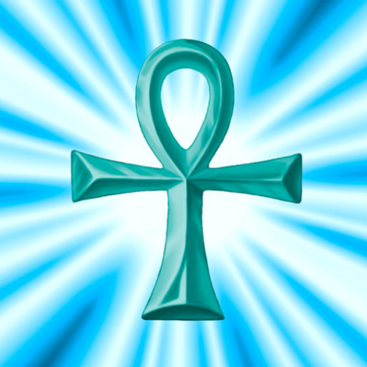

# 前言
在上古卷轴`5`天际龙裔`DLC`所在的索瑟海姆`Solstheim`，有`3`个隐藏任务。
1. 召唤巨人卡斯塔`Karstaag`
1. 偷取`Falas Selvayn`的雄鹿王子之玻璃弓`Glass Bow of the Stag Prince`
1. 收集`5`个卡古梅兹共振宝石`Kagrumez Resonance Gem`

当我在完成卡古梅兹共振宝石的任务时，最后一颗宝石却怎么也找不到。
这里记录下怎么拿到沙瓦尼`Revus Sarvani`的那颗卡古梅兹共振宝石`Kagrumez Resonance Gem`。

<!-- more -->

# Revus Sarvani 的位置
沙瓦尼`Revus Sarvani`就在泰尔密希临`Tel Mithryn`左上角不远处，有一个很显眼的阔步沙蚤`Dusty`，旁边有一个营地，沙瓦尼`Revus Sarvani`就在这里。
找他购买一个卡古梅兹共振宝石`Kagrumez Resonance Gem`即可。


# 找不到Revus Sarvani
最大的可能就是他被杀了，葬身荒郊野岭。
为什么呢? 
首先米拉克`Miraak`没被打倒前，营地对岸会有一个潜伏者维护者`Lurker Vindicator`，这个几乎是陆地最强近战兵种。
另外，营地附近会刷出几只灰烬魔`Ash Spawn`。
还有，泰尔密希临`Tel Mithryn`的管家任务，管家会被几只灰烬魔`Ash Spawn`杀死，这个地点也在营地附近。

综上，这附近是非常危险的，沙瓦尼`Revus Sarvani`基本不可能存活太久。
所以对于老手，上岛第一件事，就应该是去买卡古梅兹共振宝石`Kagrumez Resonance Gem`。


# 死者苏生——复活Revus Sarvani
怎么确定他死了呢?
网上有说，在控制台输入`coc wideadbodycleanupcell`，进入一个墓地空间，可以看到死去`NPC`的尸体，但是我没找到沙瓦尼`Revus Sarvani`的尸体。

我们换个思路，在控制台输入`player.moveto xx02C1EA`，**将自己移动到`NPC`旁边**。
从[`wiki`](https://en.uesp.net/wiki/Dragonborn:Revus_Sarvani) 上可以看到沙瓦尼`Revus Sarvani`的代码就是`xx02C1EA`。
这个`xx`一般是`00`、`01`、`02`、`03`、`04`。 我这边是`04`，也就是`player.moveto 0402C1EA`。
不想猜的话，可以进泰尔密希临`Tel Mithryn`，打开控制台，点击任意一个`NPC`，就可以看到`ID`的前缀了。

如果前缀猜错，就会报错`Invalid`。

输入完毕后，我们会移动到阔步沙蚤`Dusty`的营地旁边。
接下来我们发送**魔法卡——死者苏生**

在控制台输入以下两条指令，锁定该人物，复活。
```text
prid xx02C1EA
resurrect
```
这样沙瓦尼`Revus Sarvani`就复活了，和他进行交易吧。

# 参考资料
- [Dragonborn: Revus Sarvani](https://en.uesp.net/wiki/Dragonborn:Revus_Sarvani)
- [someone_i_cant_find_in_dragonborn](https://www.reddit.com/r/skyrim/comments/18xju7/someone_i_cant_find_in_dragonborn/)