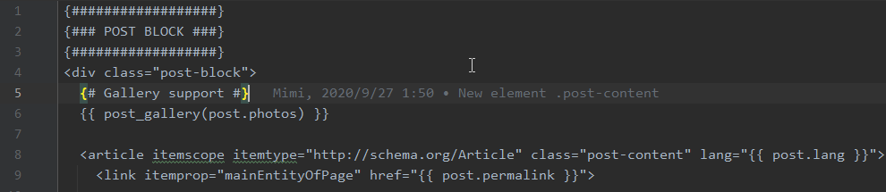
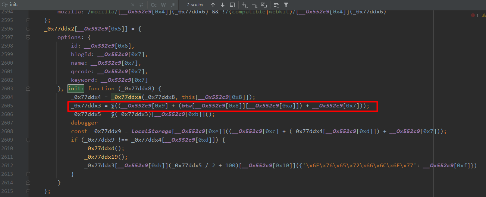

  
# 重拾博客
很久没有分享博客了，也是最近比较忙的原因。这几天对博客代码重构了一下，主要针对以下几点
1. 搭建本地`NodeJs`环境
2. 优化`Github Action`自动化构建流程
3. 调整`post`目录下的文章目录结构
4. 开了一个公众号，逆向分析并修改`readMore`脚本，引流到公众号

<!-- more -->

# 遇到的问题
为了宣传我的公众号，我参考 [【知识积累】Hexo中next主题微信引流教程](https://gylq.gitee.io/posts/137.html) 这篇文章进行配置。
但是过程中遇到了一个问题，我博客的`Next`主题似乎太新了，是`v8`版本的。因此带来了几个问题
1. 最新版的`Next`主题将`_layout.swig`改为了`_layout.njk`
2. `Next`在主题配置文件里支持了`custom_file_path`属性, 不需要再修改`_layout.njk`
3. `<div id="content">`不存在, 这里要修改原来的`readmore.js`的注入方式

迫于网上答案过于陈旧，我这里重新再梳理下`v8`版本的`Next`主题要怎么使用`readmore.js`脚本。
这个思路可用于其他主题的适配。~~（必可活用于下次~~


# 自定义模块页面
`Next`主题的 [主题配置文件](https://github.com/next-theme/hexo-theme-next/blob/v8.8.2/_config.yml#L21-L31) 里已经提供了扩展点
```yaml
custom_file_path:
  footer: source/_data/footer.njk
``` 
我们修改完主题配置文件后, 在`source/_data`目录下创建一个`footer.njk`文件.
在里面填上`script`脚本
```html

<script src="/js/readmore.js" type="text/javascript"></script>
<!--<script src="https://readmore.openwrite.cn/js/readmore.js" type="text/javascript"></script>-->
<script>
    const btw = new BTWPlugin();
    btw.init({
        id: 'container',
        blogId: '30660-1666263355112-307',
        name: '岁寒的编程随想',
        qrcode: 'https://blog.ahao.moe/images/config/wechat_channel.jpg',
        keyword: 'more',
    });
</script>

```

# 反混淆魔改readmore脚本
从上面那套`js`语法可以猜测出`readmore`的遮罩层，是根据`id`为`container`的`DOM`元素进行定位操作的。
但是我们发现`v8`版本的文章部分已经没有`id`这个属性了
```html
<div class="main-inner ">
  
  
  
</div>
```
这里的``语法，其实就是将`themes/next/layout/_macro/post.njk`这个文件引进来。


这个`<article>`就是文章的主要区域, 我们目标是`div.post-block`。

在`source/js`目录下创建一个`readmore.js`文件，将 [原始`readmore.js`](https://readmore.openwrite.cn/js/readmore.js) 的内容复制进去, 并格式化。
原始的`readmore.js`是经过混淆加密的，我们先借助`IDE`进行格式化.
然后找到我们熟悉的`init`初始化方法，加上`debugger`断点

可以看到这里是通过`jQuery`的`$('#container')`定位的, 那就简单了, 直接把这一行替换成以下代码即可
```js
_0x77ddx3 = $('div.post-block');
```
思路就是这样，如果你的主题不是`Next v8`，那么也是修改这行代码，取想要`hack`的元素即可。

# 微信公众号的配置
剩下的公众号配置就按照`openwrite`的教程来处理就可以了，这里不再赘诉
https://openwrite.cn/guide/readmore/readmore.html

# 最后
想了想，最后还是没有强制引流到公众号。有感兴趣的就点击下面的微信公众号或者`RSS`订阅吧。