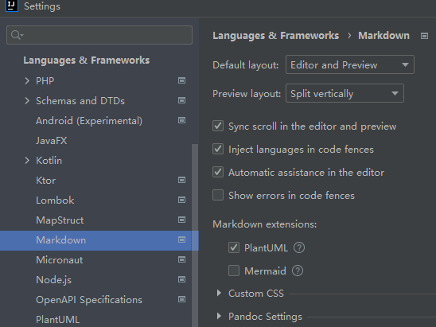
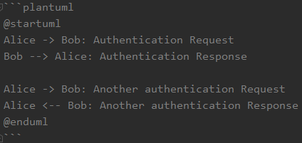
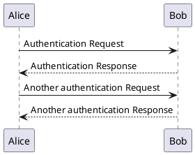

# 介绍
[Markdown](http://daringfireball.net/projects/markdown/) 作为一种网络书写语言，特别适合程序员书写文档：
- 全文本格式，方便进行`diff`，`patch`和版本的管理；
- 格式直观，简单易学，便于书写和阅读；
- 兼容 `HTML`，能方便地转换为 `pdf`，`doc`等格式；
- 支持 `Linux`，`Windows`，`Mac`；
- 支持内嵌代码和语法高亮；

<!-- more -->

本文的目标读者是对`Markdown`有一定了解的群体，能简单书写`Markdown`笔记

# 通过 [`plantuml`](https://plantuml.com/zh/) 编程式插入`UML`图片
`yuml.me`只适用于简单的`UML`图片生成，如果是比较复杂的`UML`，那么响应的描述预言挤在`url`里，会导致`url`特别长。而浏览器的`url`[长度是有限制的](https://stackoverflow.com/questions/417142)

在`Markdown`里使用`plantuml`绘图，需要`IDE`的支持。

## `IDEA`支持`UML`
我使用的是`Intellij IDEA`进行编辑。`IDEA`现在有个关于`Markdown`的[`Bug IDEA-285306`](https://youtrack.jetbrains.com/issue/IDEA-285306)` ，还没标记为修复。
>  

第一步，打开`plantuml`的配置，`File->Settings->Language & Frameworks -> Markdown -> plantuml`

第二步，下载 [`plantuml-1.2021.16.jar`](https://github.com/plantuml/plantuml/releases/tag/v1.2021.16) ，改名为`plantuml.jar`。
拷贝到`IDEA`的数据目录`%LOCALAPPDATA%\JetBrains\IntelliJIdea2021.3`里面的`download-cache\plantuml`目录下。

第三步，重启`IDEA`即可。

如果还有问题，可以参考下[`IDEA-285306`](https://youtrack.jetbrains.com/issue/IDEA-285306)

## `Hexo`支持`plantuml`

不止编辑器预览需要支持`plantuml`，渲染到`hexo`博客上也需要支持`plantuml`。
我们安装依赖[`hexo-filter-plantuml`](https://github.com/miao1007/hexo-filter-plantuml) 
然后编写`plantuml`语法即可。

# 使用`LaTeX`语法编写数学公式
在线生成图片的网站: [`latex.codecogs.com`](https://latex.codecogs.com/eqneditor/editor.php?lang=zh-cn)

比如`https://latex.codecogs.com/gif.latex?x^{2}+y^{2}=z^{2}`，就可以得到下面的数学公式图片
 

# 参考资料
- [在 Markdown 中嵌入 UML 文档](http://xiaocong.github.io/blog/2013/04/22/writing-development-documentation-with-markdown/)
